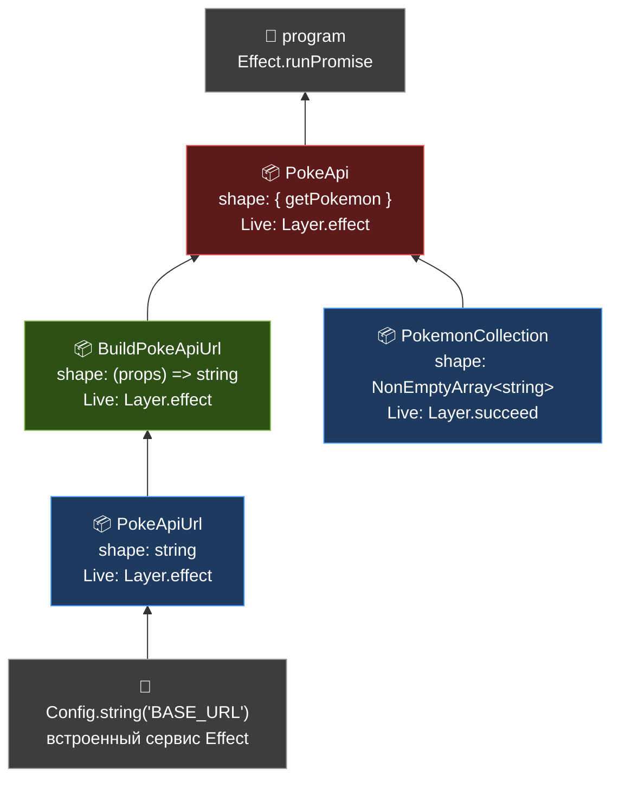

# Зависимости между сервисами Effect

Источник: [typeonce.dev — Layers / Dependencies between services](https://www.typeonce.dev/course/effect-beginners-complete-getting-started/layers/dependencies-between-services)

Документ соответствует текущему стилю кода в проекте: классовый `Context.Tag<Self, Shape>()` + `static readonly Live` через `Layer.succeed` / `Layer.effect`.

## Граф зависимостей



Стрелки читаются «**X нужен для построения Y**». Чем ниже сервис — тем он более «листовой».

---

## Уровень 1 — листья (без зависимостей)

### `PokemonCollection` — просто данные

```typescript
import { type Array, Context, Layer } from "effect";

export class PokemonCollection extends Context.Tag("PokemonCollection")<
  PokemonCollection,
  Array.NonEmptyArray<string>
>() {
  // Зависимостей нет → Layer.succeed просто кладёт готовое значение
  static readonly Live = Layer.succeed(this, ["staryu", "perrserker", "flaaffy"]);
  // тип Live: Layer<PokemonCollection, never, never>
}
```

Что важно:

- `Layer.succeed(this, value)` — самый простой слой: «положи в контекст под ключом `this` (т.е. под этим классом) такое-то значение».
- `this` в `static` — это ссылка на сам класс `PokemonCollection`. Это **F-bounded polymorphism**: класс ссылается на себя в собственной декларации, и TS использует это, чтобы привязать слой к нужному `Self`.
- В `R`-канале слоя — `never`: никаких зависимостей.

---

## Уровень 2 — зависит от внешнего `Config`

### `PokeApiUrl` — строка, построенная из env

```typescript
import { Context, Effect, Config, Layer } from "effect";

export class PokeApiUrl extends Context.Tag("PokeApiUrl")<PokeApiUrl, string>() {
  static readonly Live = Layer.effect(
    this,
    Effect.gen(function* () {
      const baseUrl = yield* Config.string("BASE_URL");
      return `${baseUrl}/api/v2/pokemon`;
    }),
  );
  // тип Live: Layer<PokeApiUrl, ConfigError, never>
  //                              ^^^^^^^^^^^^
  //                  ошибки из Config попадают в E-канал слоя
}
```

`Layer.effect(this, effect)` — слой, который выполняет `effect`, забирает его success-значение и кладёт под ключ `this`. Эффект выполнится **один раз за рантайм** — это и есть «честный синглтон».

---

## Уровень 3 — зависит от другого сервиса

### `BuildPokeApiUrl` — функция, тянущая `PokeApiUrl`

```typescript
import { Context, Effect, Layer } from "effect";
import { PokeApiUrl } from "./poke-api-url.services.ts";

export class BuildPokeApiUrl extends Context.Tag("BuildPokeApiUrl")<
  BuildPokeApiUrl,
  (props: { name: string }) => string
>() {
  static readonly Live = Layer.effect(
    this,
    Effect.gen(function* () {
      const pokeApiUrl = yield* PokeApiUrl;
      return ({ name }: { name: string }) => `${pokeApiUrl}/${name}/`;
    }),
  );
  // тип Live: Layer<BuildPokeApiUrl, never, PokeApiUrl>
  //                                          ^^^^^^^^^
  //                  зависимость живёт в R-канале СЛОЯ,
  //                  а не в типе функции наружу
}
```

Ключевой момент: `PokeApiUrl` теперь в `R` **слоя**, а не в типе возвращаемой функции. Сама функция — обычная `(props) => string`, без следов `R`. Это и значит «зависимость поднята на уровень слоя».

---

## Уровень 4 — корневой сервис

### `PokeApi` — использует сразу два сервиса

```typescript
import { Context, Effect, Layer, Schema, type ParseResult } from "effect";

import { Pokemon } from "../schemas.ts";
import { FetchError, JsonError } from "../errors.ts";
import { BuildPokeApiUrl } from "./build-poke-api-url.services.ts";
import { PokemonCollection } from "./pokemon-collection.services.ts";

export class PokeApi extends Context.Tag("PokeApi")<
  PokeApi,
  {
    readonly getPokemon: Effect.Effect<
      Pokemon,
      FetchError | JsonError | ParseResult.ParseError
      // ← R пустой: зависимости подняты на уровень Layer ниже
    >;
  }
>() {
  static readonly Live = Layer.effect(
    this,
    Effect.gen(function* () {
      // Зависимости разрешаются ОДИН раз при построении слоя
      const pokemonCollection = yield* PokemonCollection;
      const buildPokeApiUrl = yield* BuildPokeApiUrl;

      return {
        // А внутри метода они уже захвачены замыканием
        getPokemon: Effect.gen(function* () {
          const requestUrl = buildPokeApiUrl({
            name: pokemonCollection[0],
          });

          const response = yield* Effect.tryPromise({
            try: () => fetch(requestUrl),
            catch: () => new FetchError(),
          });

          if (!response.ok) {
            return yield* new FetchError();
          }

          const json = yield* Effect.tryPromise({
            try: () => response.json(),
            catch: () => new JsonError(),
          });

          return yield* Schema.decodeUnknown(Pokemon)(json);
        }),
      };
    }),
  );
  // тип Live: Layer<PokeApi, never, BuildPokeApiUrl | PokemonCollection>
}
```

**Что изменилось по сравнению со старой версией без Layer:**

|                    | Старо (только Tag)                                         | Сейчас (Tag + Layer)                      |
| ------------------ | ---------------------------------------------------------- | ----------------------------------------- |
| Тип `getPokemon`   | `Effect<Pokemon, …, BuildPokeApiUrl \| PokemonCollection>` | `Effect<Pokemon, …, never>`               |
| Где зависимости    | В `R`-канале **метода** — утекают наружу                   | В `R`-канале **слоя** — инкапсулированы   |
| Подмена реализации | Переписываешь цепочку `provideService`                     | Одна строка: `Layer.provide(PokeApiTest)` |
| Синглтоны          | Руками                                                     | Автоматически                             |

---

## Сборка всего вместе

```typescript
import { Effect, Layer } from "effect";
import { PokeApi } from "./services/poke-api.services.ts";
import { PokemonCollection } from "./services/pokemon-collection.services.ts";
import { PokeApiUrl } from "./services/poke-api-url.services.ts";
import { BuildPokeApiUrl } from "./services/build-poke-api-url.services.ts";

const program = Effect.gen(function* () {
  const pokeApi = yield* PokeApi;
  return yield* pokeApi.getPokemon;
});

// Композируем слои: PokeApi внутри использует Build/Collection,
// Build использует Url, Url использует Config
const MainLayer = PokeApi.Live.pipe(
  Layer.provide(BuildPokeApiUrl.Live),
  Layer.provide(PokeApiUrl.Live),
  Layer.provide(PokemonCollection.Live),
);

const runnable = program.pipe(Effect.provide(MainLayer));

Effect.runPromise(runnable).then(console.log);
```

**Что делает `Layer.provide`:** «прицепи к этому слою его зависимости». Effect сам пройдёт граф, выполнит каждый слой один раз, разрешит порядок. Тебе не нужно вручную следить, что чему провайдить.

---

## Что дал переход с `provideService` на `Layer`

1. **Инкапсуляция.** Метод `getPokemon` снаружи — `Effect<Pokemon, …, never>`. Никто не знает, какие сервисы он использует внутри.
2. **Композиция.** Слои собираются в один граф через `Layer.provide` / `Layer.merge`. Нет ручной лесенки.
3. **Синглтоны.** Каждый `Layer.effect` исполняется один раз за рантайм. `PokeApiUrl.Live` не будет читать `BASE_URL` десять раз.
4. **Подмена.** Хочешь тесты с моком `BuildPokeApiUrl`? Подменяешь один слой в `MainLayer`, остальные не трогаешь.

---

## Идиомы и тонкости

- **`Layer.succeed(this, value)`** — для готовых значений. Тип: `Layer<Self, never, never>`.
- **`Layer.effect(this, effect)`** — когда сервис нужно построить через `Effect.gen` (например, прочитать конфиг или другие сервисы). Тип: `Layer<Self, E, R>`, где `E` и `R` берутся из эффекта.
- **`Layer.scoped(this, effect)`** — то же, что `Layer.effect`, но эффект может использовать `Scope` (открытие ресурсов с автоматическим закрытием при завершении рантайма).
- **`this` в `static readonly Live`** — всегда указывает на сам класс. Это идиома, благодаря которой не нужно дублировать имя.
